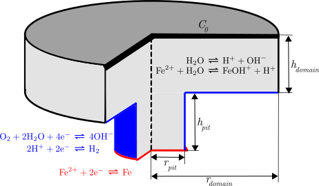

# Corrosion under Supporting Surface Conditions Simulation

If this code is used, please cite T. Hageman, C. Andrade and E. Martínez-Pañeda, Corrosion rates under charge-conservation conditions. Electrochimica Acta (2023).  [10.1016/j.electacta.2023.142624](https://doi.org/10.1016/j.electacta.2023.142624)

Matlab code performing the finite element simulation of an electrolyte adjacent to a corroding metal. For the electrochemical reactions, charge conservation conditions are used at the interface to couple the anodic corrosion rate to the rates of cathodic reactions. More detailed documentation is provided [here](Documentation/main.pdf).

 
